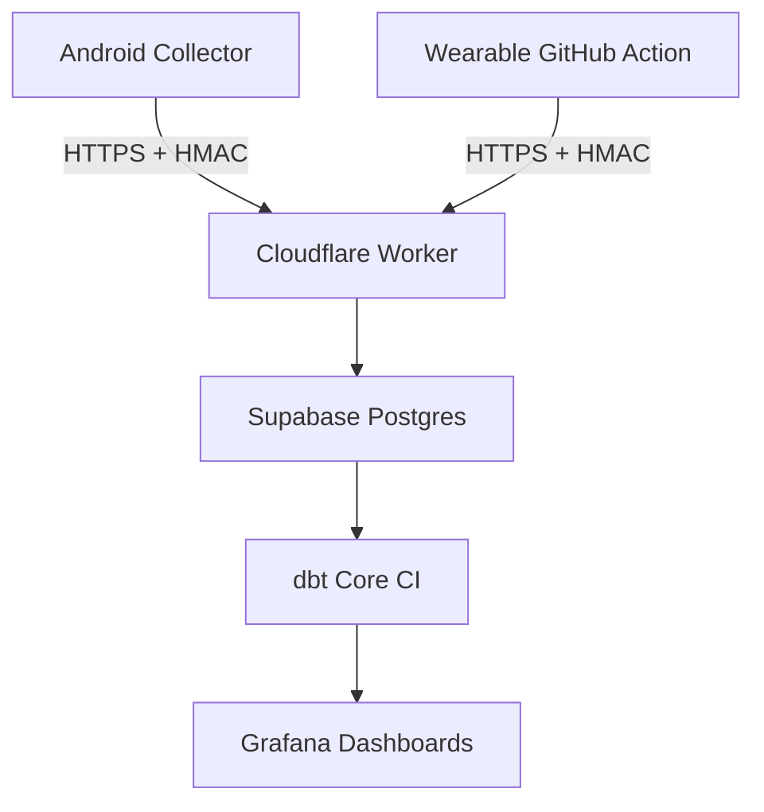

# Mobile & Wearable Usage Pipeline

[](https://github.com/adwait009/mobile-wearable-usage-pipeline/actions/workflows/ci.yml)
[](LICENSE)


> An **end-to-end, serverless & free-tier** data pipeline that correlates Android screen-time with Samsung wearable activity and sleep metrics. Built with Kotlin, Cloudflare Workers, Supabase, dbt, and Grafana Cloud.

---

## ✨ Key Features

* **Android Collector (Kotlin)** – Captures digital wellbeing usage events in the background with minimal battery impact.
* **Wearable Sync (GitHub Actions)** – Fetches steps, heart-rate, and sleep data from Samsung Health APIs.
* **Secure Ingestion** – Cloudflare Worker validates HMAC-signed payloads before persisting to Supabase Postgres.
* **Transform & Test** – dbt Core models (+ tests & docs) run daily via CI to build curated marts.
* **Dashboards & Alerts** – Grafana Cloud visualises correlations; free notifications for anomalies.
* **100 % Free-tier** – Designed to remain under the no-cost thresholds of every service used.

## 🚀 Quickstart

### 1. Clone & Bootstrap
```bash
$ git clone https://github.com/<org>/mobile-wearable-usage-pipeline.git
$ cd mobile-wearable-usage-pipeline

# Create virtual env & install dev deps (blazing-fast 🏎️)
$ uv venv && uv pip install -r requirements.txt -r requirements-dev.txt
$ source .venv/bin/activate  # Windows: .venv\Scripts\activate
```

### 2. Run Checks
```bash
$ ruff format --check .   # formatting
$ ruff check .            # linting
$ pytest -q               # tests (Python only)
```

### 3. Android Collector (optional)
```bash
$ cd android && ./gradlew installDebug
```
This installs the prototype collector on a connected device/emulator.

> **Tip:** For full local-stack instructions (Supabase & Grafana), see [`docs/local-dev.md`](docs/local-dev.md) *(coming soon)*.

## 🏗️ Project Structure
```
mobile-wearable-usage-pipeline/
├── android/            # Kotlin foreground service
├── wearable_ingestion/ # GH Actions workflow for Samsung Health
├── infrastructure/     # Terraform modules & env configs
├── dbt/                # dbt project (models & tests)
├── docs/               # Architecture diagrams & docs
└── notebooks/          # Exploratory analysis (Colab/Jupyter)
```

## 📐 High-Level Architecture


## 🛣️ Roadmap
- [ ] Week 1: Repo bootstrap & D1 collector prototype
- [ ] Week 2: Wearable sync script & ingestion endpoint
- [ ] Week 3: End-to-end ingestion → Supabase; staging models
- [ ] Week 4: Marts, Grafana dashboards, retention policies
- [ ] Week 5: Correlation notebooks & cost monitors
- [ ] Week 6: Blog post & final demo

See [Project Plan](MobileUsagePipeline_ProjectPlan_Reviewed.md) for full timeline.

## 🤝 Contributing
Contributions are welcome! Please read the [CONTRIBUTING](CONTRIBUTING.md) guidelines and adhere to the [Code of Conduct](CODE_OF_CONDUCT.md).

## 📝 License

This project is licensed under the [MIT License](LICENSE).

---

<div align="center">
Made with ❤️ & free-tier services.
</div>